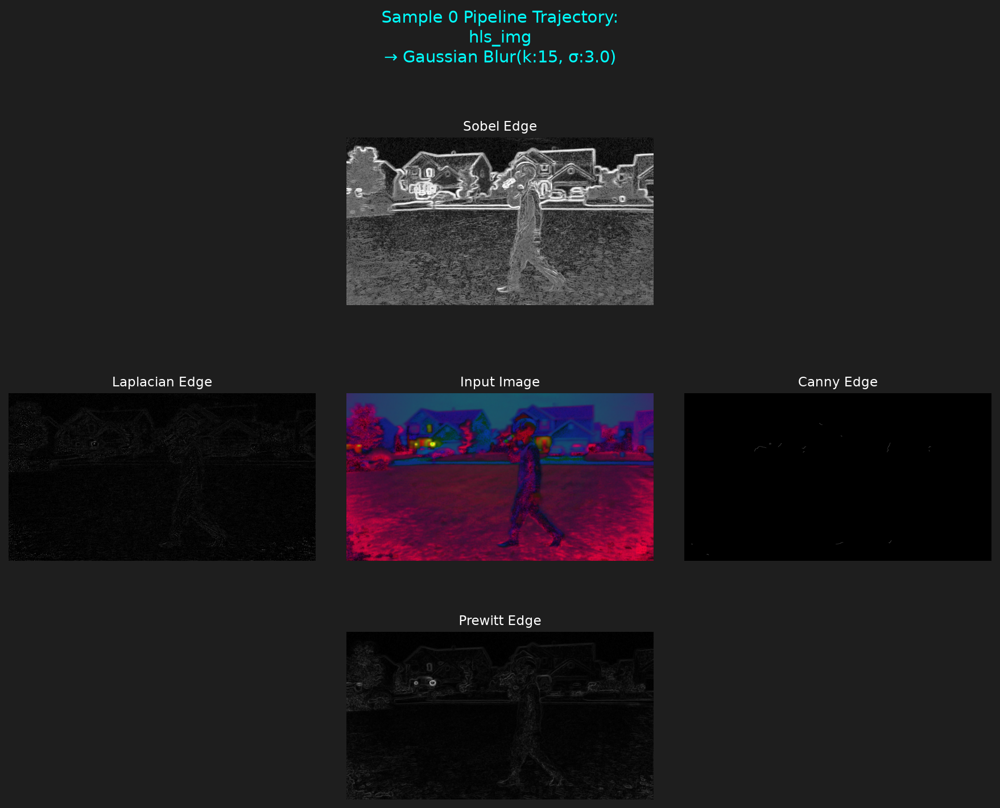
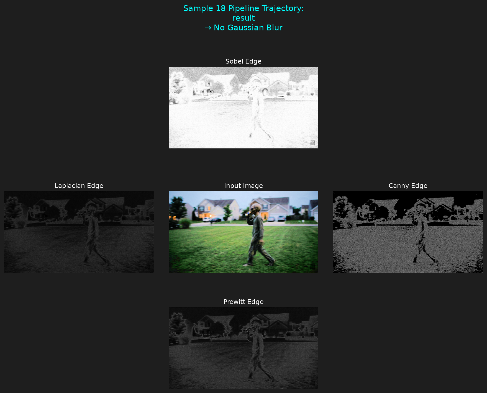
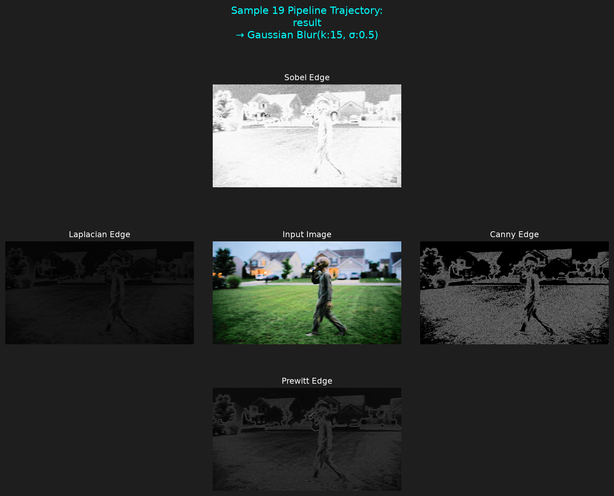
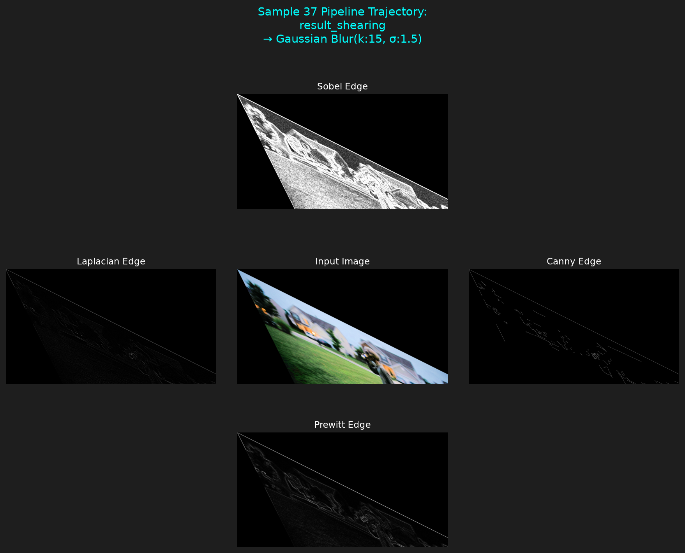

# Main Project README

## Part 2

### Question1: Find and print basic image statistics of the original image for each individual channel (min, max, average, median, mode, skew, range, standard deviation, variance)

1.In order to read the statistics of the image first I had to flatten the image and convert it to greyscale.

### Question 8: Apply a Gaussian blur to each image using the levels of sigma: 0.5, 1.0, 1.5, 2.0, 2.5, 3.0, 3.5. Discuss how the level of sigma changes the image. Save each of those images to new files.

1.At this point I decided to plan for the rest of the questions. I took the already existing 21 images and made an array for each image.
2.I then made an object for creating the gaussian blurred image. In the object I wrote a method for applying, naming, and saving the images to a new file.
3.I used a counter for a quick fix to a problem with my initial naming. I was naming the files for each kernel and each sigmaX value but I was not keeping track of the original image name. This was causing each iteration to overwrite the file.
4.The sigmaX value increases the blurriness, but it was noticeable when I used a sigmaX of 20 or higher.

## Part 3

### Question 4: Perform these edge detection techniques on that subset:

#### Prewitt

1.In my dataset the prewitt detected edges better with higher sigmaX gaussian blur but it did not detect edges well with a translated image

2.Pros: prewitt uses small kernel size resulting in a lower computational cost.

Cons: Prewitt is sensitive to noise.

#### Sobel

1.In my dataset the sobel did better with the higher sigmaX values

2.Pros: Better at handling noise than prewitt. Sobel also uses smaller kernal size making it a low computational demand.

3.Cons: While not as sensitive to noise as prewitt, it still is sensitive to noise. Sobel does better with higher gradient but not as well with thinner edges.

#### Canny

1.In my dataset cannel did better with the lower sigmaX values

2.Pros: Typically a gold standard for line detection. Since canny usually begins with gaussian smoothing it can reduce the image noise before edge detection begins.

3.Cons:Can be more computationally expensive than Sobel and Prewitt. Canny relies strongly on parameter tuning

####

1.In my dataset laplacian did not do well at any sigmaX values

2.Pros: Typically produces a strong edge response.

3.Cons: Sensitive to noise.

### Edge Detection Plot Examples

