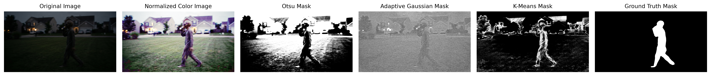

# Main Project README

# Homework 1

## Part 2

### Question1: Find and print basic image statistics of the original image for each individual channel (min, max, average, median, mode, skew, range, standard deviation, variance)

1.In order to read the statistics of the image first I had to flatten the image and convert it to greyscale.

### Question 8: Apply a Gaussian blur to each image using the levels of sigma: 0.5, 1.0, 1.5, 2.0, 2.5, 3.0, 3.5. Discuss how the level of sigma changes the image. Save each of those images to new files.

1.At this point I decided to plan for the rest of the questions. I took the already existing 21 images and made an array for each image.
2.I then made an object for creating the gaussian blurred image. In the object I wrote a method for applying, naming, and saving the images to a new file.
3.I used a counter for a quick fix to a problem with my initial naming. I was naming the files for each kernel and each sigmaX value but I was not keeping track of the original image name. This was causing each iteration to overwrite the file.
4.The sigmaX value increases the blurriness, but it was noticeable when I used a sigmaX of 20 or higher.

## Part 3

### Question 4: Perform these edge detection techniques on that subset:

#### Prewitt

1.In my dataset the prewitt detected edges better with higher sigmaX gaussian blur but it did not detect edges well with a translated image

2.Pros: prewitt uses small kernel size resulting in a lower computational cost.

Cons: Prewitt is sensitive to noise.

#### Sobel

1.In my dataset the sobel did better with the higher sigmaX values

2.Pros: Better at handling noise than prewitt. Sobel also uses smaller kernal size making it a low computational demand.

3.Cons: While not as sensitive to noise as prewitt, it still is sensitive to noise. Sobel does better with higher gradient but not as well with thinner edges.

#### Canny

1.In my dataset cannel did better with the lower sigmaX values

2.Pros: Typically a gold standard for line detection. Since canny usually begins with gaussian smoothing it can reduce the image noise before edge detection begins.

3.Cons:Can be more computationally expensive than Sobel and Prewitt. Canny relies strongly on parameter tuning

####

1.In my dataset laplacian did not do well at any sigmaX values

2.Pros: Typically produces a strong edge response.

3.Cons: Sensitive to noise.

### Edge Detection Plot Examples

# Homework 2

## Qualitative Analysis

### Adaptive Gaussian Thresholding

1. Pro: Adaptive does better than otsu at handling images with uneven lighting. Typically this is used for outdoor images since the lighting is uneven with different background textures

2. Con: Secondary to a cluttered small background detail or a poor block size the adaptive threshold can become noisy and include too much background noise.

3. Background Noise: Since the algorithm focuses on local pixel areas the background with highly detailed textures may get pulled to the foreground. This occurs since the method might treat these texture changes as important.

4. Color Normalization: This improves the contrast locally which can help the algorithm detect the unknown figure more clearly. Normalized images can also provide a sharper result. With what I discussed earlier that sharpness can increase false positive detections.

### Otsu Thresholding

1. Pro: Otsu does not require manually setting the threshold. This technique performs best when the foreground and background have a lighting contrast. So if the object is dark and the background is light or visa versa, then Otsu typically performs well.

2. Con: Otsu does not perform well with uneven lighting or heavy amounts of shadows. Like stated earlier this typically is seen with outdoor scenes.

3. Background Noise: Since Otsu looks at the full image histogram a lot of background noise can make the binary mask noisy causing the unknown figure to merge with sections of the background.

4. Color Normalization: The increase in contrast can help Otsu make the unknown figure stand out more against the background. Since histogram equalization can enhance background texture/noise like I discussed earlier this can cause issues with the unknown figure merging with the background.

### K-Means Color Space Clustering

1. Pro: K-means does not require grayscale intensity. It uses color imformation which can be beneficial for complex outdoor scenes.

2. Cons: K-Means does not detect the cluster with the target figure. This requires the individual to inspect the clusters and choose the cluster that best captures the figure. K-Means can produce different results when using random initialization.

3. Background Noise: If the background noise is similar in color to the unknown figure than this can cause them to be grouped into the same cluster. K-Means does typically handle background noise better than Otsu since its grouping on color similarity rather than just brightness.

4. Color Normalization: Since K-Means uses color to cluster normalization can improve K-Means by making the colors more distinct.

