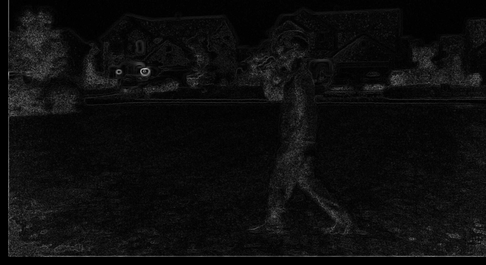
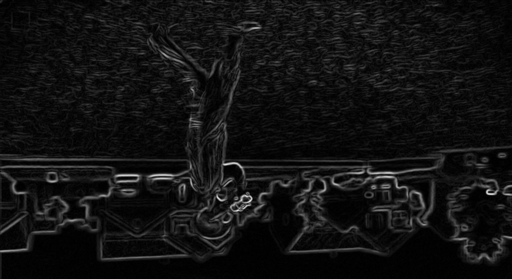
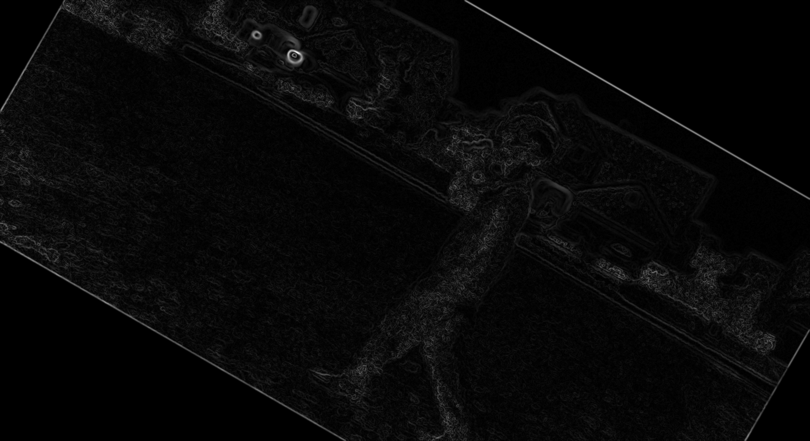
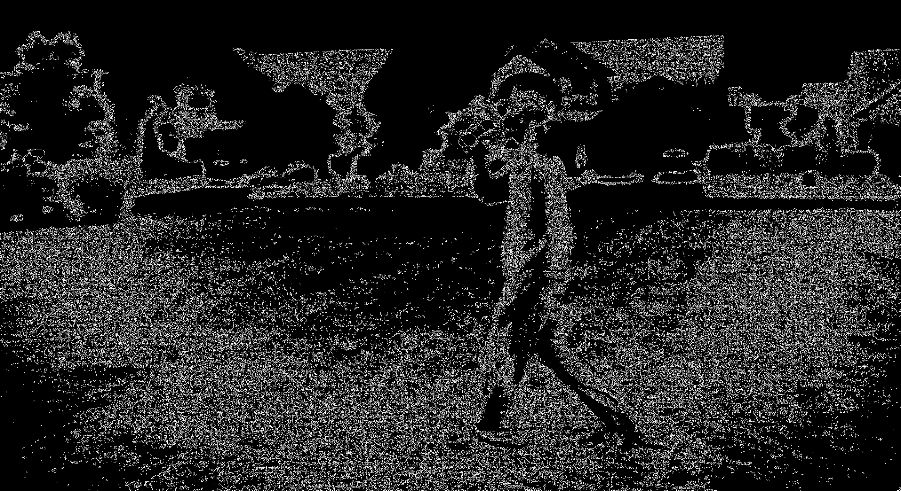
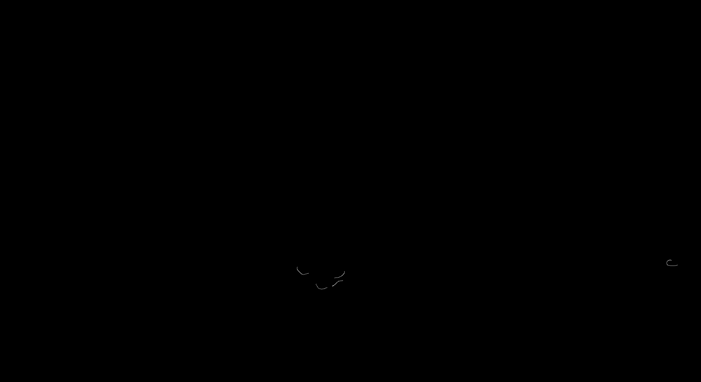
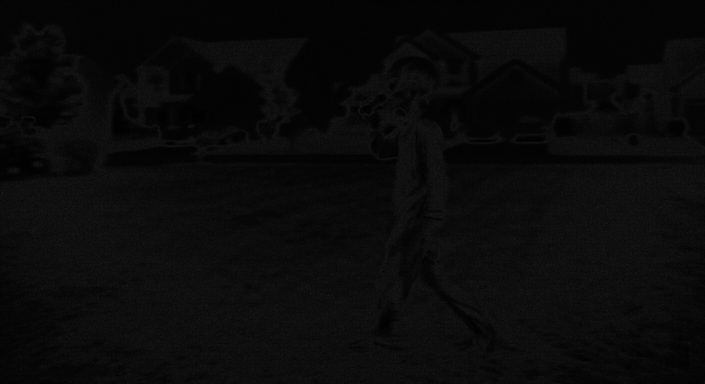
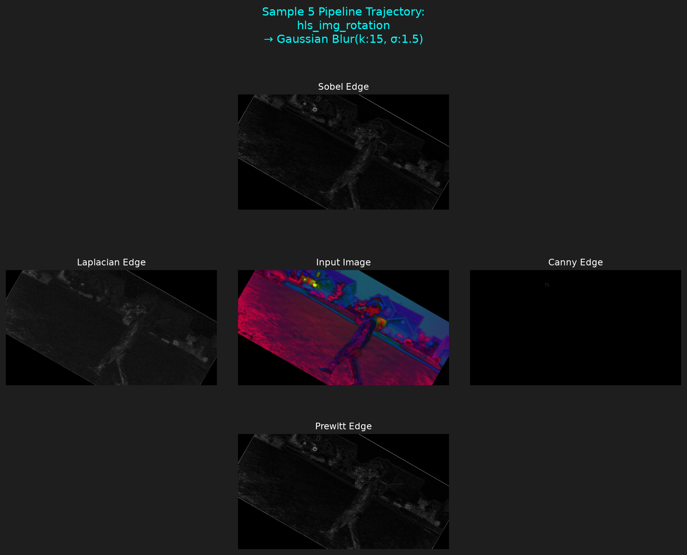
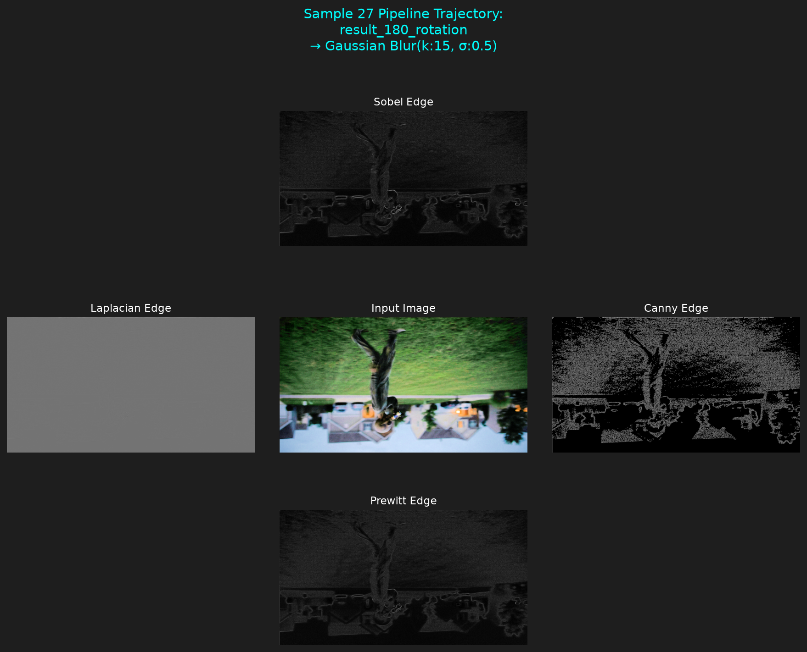
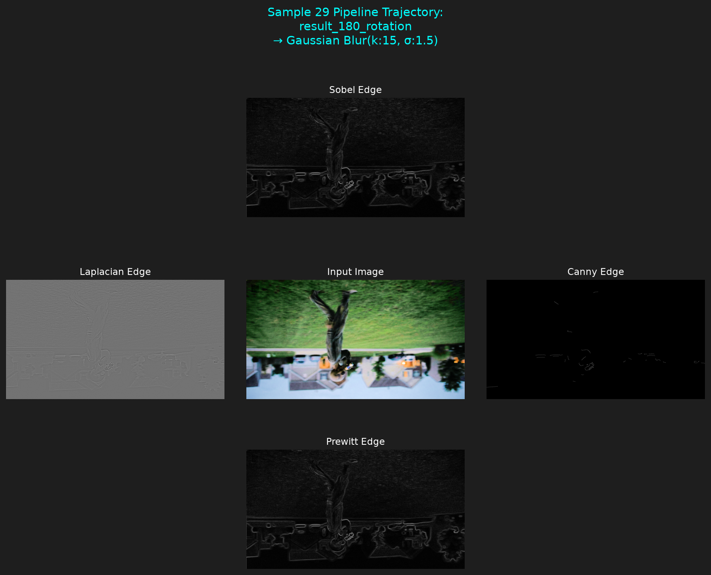
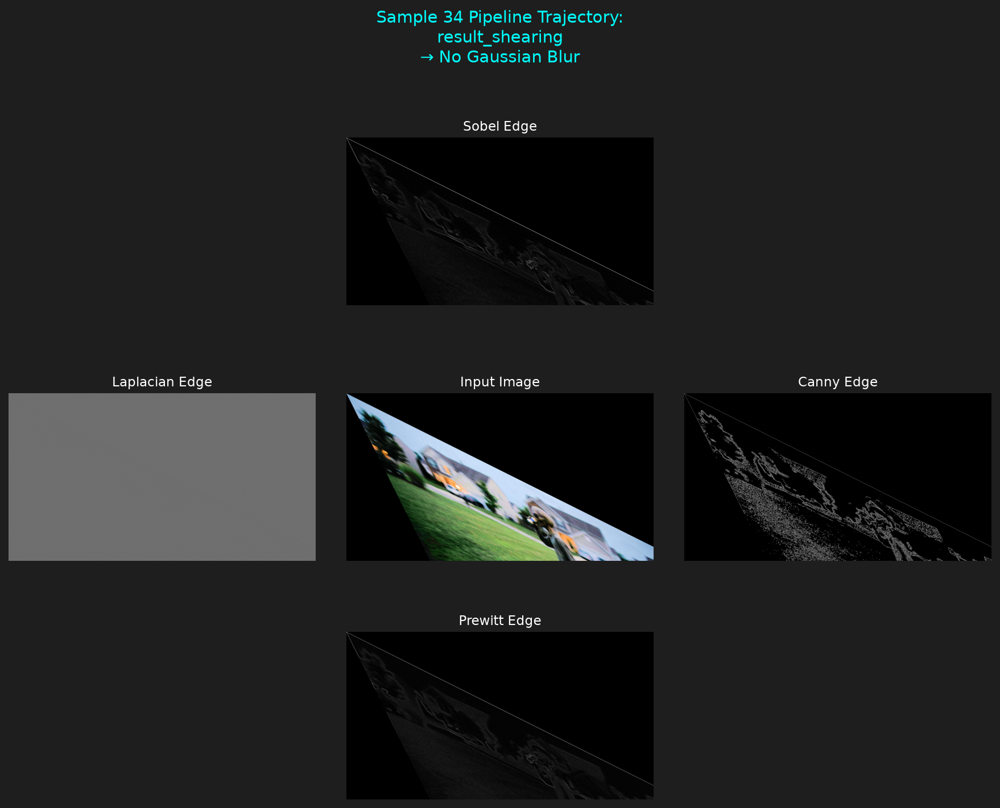

# Homework 1

## Part 2

### Question1: Find and print basic image statistics of the original image for each individual channel (min, max, average, median, mode, skew, range, standard deviation, variance)

1.In order to read the statistics of the image first I had to flatten the image and convert it to greyscale.

### Question 8: Apply a Gaussian blur to each image using the levels of sigma: 0.5, 1.0, 1.5, 2.0, 2.5, 3.0, 3.5. Discuss how the level of sigma changes the image. Save each of those images to new files.

1.At this point I decided to plan for the rest of the questions. I took the already existing 21 images and made an array for each image.
2.I then made an object for creating the gaussian blurred image. In the object I wrote a method for applying, naming, and saving the images to a new file.
3.I used a counter for a quick fix to a problem with my initial naming. I was naming the files for each kernel and each sigmaX value but I was not keeping track of the original image name. This was causing each iteration to overwrite the file.
4.The sigmaX value increases the blurriness, but it was noticeable when I used a sigmaX of 20 or higher.

## Edge Detection Analysis

For this section I applied four different edge detection techniques to the selected subset of generated images: Sobel, Laplacian, Canny, and Prewitt. The selected subsets included transformed and Gaussian-blurred versions of the image, which made it possible to compare how each detector responded to different levels of smoothing and image transformation.

#### Prewitt Edge Detection

Prewitt produced simple edge maps and worked best when the image had already been smoothed with a stronger Gaussian blur. In the lower blurred images Prewitt partially picked up the smaller background noise but did not detect the anomoly. As the sigma increased, the noise was reduced, which allowed the prewitt detection to detect the object boundries of the anomaly.

Prewitt was still able to detect with the heavily transformed images. This still was only able to be seen for the higher sigma images. While it was able to detect the edges on those images it was not as strong as a detection as the untransformed images.

##### Positive Example

##### Negative Example

#### Sobel Edge Detection

Like the Prewitt, Sobel performed better when the image had been smoothed with a stronger Gaussian blur. As the sigma increased there was an improvement on the edge detection. This occured because there was decrease in background noise.

Like the Prewitt the Sobel detection was able to detect the transformed images. Also similar to Prewitt there was a diminished detection from the transformed images.

There was a slight improvement on the edge detection for Sobel vs the Prewitt images. This likely occured since Sobel gives a higher weight to nearby pixels.

Like Prewitt the main weakness observed was that it required a Gaussian blur and smoothing before it was able to detect edges.

##### Positive Example

##### Negative Example

#### Canny Edge Detection

Canny performed the second worst out of the different detections. Unlike Prewitt and Sobel the Canny edge detection performed better with less smoothing and Gaussian Blur.

Unlike Prewitt and Sobel it performed significantly less when the image was transformed. It was able to detect some edges but it was not able to detect the anomaly as a whole.

For the purpose of detecting the anomaly Canny did not perform well. If our purpose was to detect all the fine detailed edges in the image Canny did perform well. In the low blurred images the detection found all the background noise alonside the anomaly. This was not good because we did not want to detect the background noise.

##### Positive Example

##### Negative Example

#### Laplacian Edge Detection

Laplacian performed the worst out the methods. Laplacian method detects rapid changes in intensity which makes it sensitive to noise.

Unlike the other 3 detections the smoothing and Gaussian blur had no effect on the Laplacian detection. While this does not conclude that Laplacian method is a bad method, it is clear the Laplacian method is the wrong method for this particular image detection.

I only provided the best image because the images speaks for itself for the negative example images.

##### Positive Example

### Edge Detection Plot Examples

