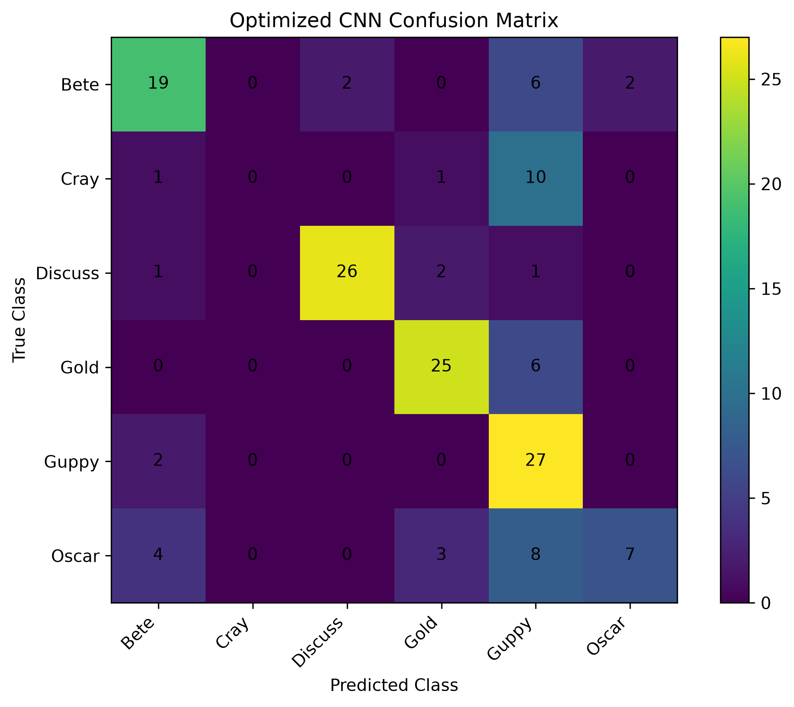
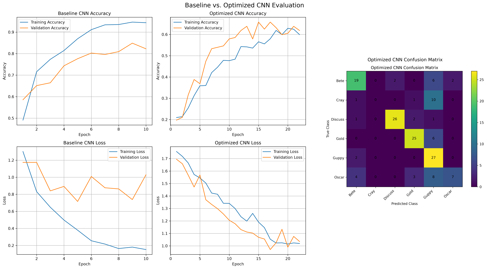

# Homework 3: Deep Learning for Fish Classification

## Project Overview

This project focuses on building and evaluating a Convolutional Neural Network (CNN) for multiclass fish image classification.

The current work completed includes:

- Project directory setup
- Dataset inspection and validation
- Stratified train/validation/test splitting
- Image preprocessing
- Class label mapping
- Training data augmentation
- Augmentation visualization

The next major step will be building and training the baseline CNN.

---

## Dataset

The dataset contains six fish classes.

| Class     | Number of Images |
| --------- | ---------------: |
| Oscar     |              145 |
| Cray      |               80 |
| Guppy     |              189 |
| Bete      |              194 |
| Gold      |              207 |
| Discuss   |              201 |
| **Total** |         **1016** |

The dataset is moderately imbalanced. The smallest class, `Cray`, contains 80 images, while the largest class, `Gold`, contains 207 images.

Because of this imbalance, a stratified train/validation/test split was used to preserve approximately the same class proportions across all three subsets.

---

## Dataset File Types

The dataset contains the following image formats:

| File Type |    Count |
| --------- | -------: |
| `.jpg`    |      962 |
| `.png`    |       54 |
| **Total** | **1016** |

---

```text
800 x 600 pixels
```

| Color Mode | Count |
| ---------- | ----: |
| RGB        |  1014 |
| RGBA       |     2 |

The preprocessing pipeline converts all images to three-channel RGB format before they are passed to the CNN.

No corrupted images were detected during the dataset audit.

---

## Train, Validation, and Test Split

The dataset was divided using a stratified split:

- Training: 70%
- Validation: 15%
- Testing: 15%
  A fixed random seed of 42 is used to make the split reproducible.
  The final split contains:
  | Split | Number of Images |
  |---|---:|
  | Training | 711 |
  | Validation | 152 |
  | Testing | 153 |
  | **Total** | **1016** |

### Per-Class Split Distribution

| Class   | Training | Validation | Testing | Total |
| ------- | -------: | ---------: | ------: | ----: |
| Bete    |      136 |         29 |      29 |   194 |
| Cray    |       56 |         12 |      12 |    80 |
| Discuss |      141 |         30 |      30 |   201 |
| Gold    |      145 |         31 |      31 |   207 |
| Guppy   |      132 |         28 |      29 |   189 |
| Oscar   |      101 |         22 |      22 |   145 |

The stratified split ensures that each class remains represented in the training, validation, and test datasets.
The split assignments are saved to:

```text
dataset_splits.csv
```

This CSV acts as the single source of truth for all future model training and evaluation.
Both the baseline CNN and optimized CNN will use the exact same train, validation, and test assignments.

---

## Class Mapping

The fish class labels are converted into numeric class IDs before being passed to the CNN.
| Class | Class ID |
|---|---:|
| Bete | 0 |
| Cray | 1 |
| Discuss | 2 |
| Gold | 3 |
| Guppy | 4 |
| Oscar | 5 |
This mapping is kept consistent across training, validation, testing, and final evaluation.

---

## Image Preprocessing

All images are processed before being passed into the CNN.
The preprocessing pipeline performs the following steps:

1. Load the image from disk
2. Convert the image to three-channel RGB
3. Resize the image from 800 x 600 to 128 x 128
4. Convert pixel values to floating-point numbers
5. Normalize pixel values from the original 0–255 range to 0–1

The final image tensor shape is:

```text
128 x 128 x 3
```

Will consider 224 x 224 if the initial model struggles to distinguish visually similar species. In lecture we discussed trying to use lower resolutions during the early HPO to reduce computational cost.

For a batch size of 32, the CNN receives image batches with the shape:

```text
(32, 128, 128, 3)
```

The preprocessing pipeline was validated with the following output:

```text
Minimum pixel value: 0.0000
Maximum pixel value: 1.0000
```

This confirms that the normalization process successfully converts image intensity values to the required [0, 1] range.

---

## Data Augmentation

Data augmentation is applied only to the training images.
The current augmentation pipeline includes:

- Random horizontal flipping
- Small random rotations
- Random contrast adjustment

These transformations introduce controlled variation into the training dataset.
The goal is to improve model generalization by reducing the likelihood that the CNN memorizes specific orientations, lighting conditions, or image characteristics.
Validation and test images are not randomly augmented.
This ensures that model performance is measured using consistent, unmodified evaluation data.

## Baseline Model

### Baseline CNN Hyperparameters

| Hyperparameter          | Value                              |
| ----------------------- | ---------------------------------- |
| Input Image Size        | `128 x 128 x 3`                    |
| Batch Size              | `32`                               |
| Maximum Epochs          | `30`                               |
| Optimizer               | `Adam`                             |
| Learning Rate           | `0.001`                            |
| Loss Function           | `Sparse Categorical Cross-Entropy` |
| Number of Classes       | `6`                                |
| Conv Layer 1 Filters    | `32`                               |
| Conv Layer 2 Filters    | `64`                               |
| Conv Layer 3 Filters    | `128`                              |
| Convolution Kernel Size | `3 x 3`                            |
| Padding                 | `same`                             |
| Activation Function     | `ReLU`                             |
| Max Pool Size           | `2 x 2`                            |
| Dense Layer Units       | `256`                              |
| Output Activation       | `Softmax`                          |
| Early Stopping Monitor  | `val_loss`                         |
| Early Stopping Patience | `5` epochs                         |
| Restore Best Weights    | `True`                             |
| Checkpoint Monitor      | `val_loss`                         |
| Save Best Model Only    | `True`                             |
| Random Seed             | `42`                               |
| Training Split          | `70%`                              |
| Validation Split        | `15%`                              |
| Test Split              | `15%`                              |
| Image Normalization     | `[0, 1]`                           |
| Horizontal Flip         | `Enabled`                          |
| Random Rotation         | `0.05`                             |
| Random Contrast         | `0.20`                             |

### Baseline Training Analysis

The baseline CNN showed strong learning performance on the training dataset. Training accuracy steadily increased to approximately 98%, while training loss decreased to approximately 0.06.

Validation performance initially improved, reaching approximately 85–86% accuracy. However, validation accuracy eventually plateaued and declined while validation loss began to increase. This divergence between training and validation performance indicates overfitting.

The model checkpoint monitored validation loss and preserved the model from the epoch with the best validation performance rather than using the final training epoch. These results suggest that the baseline model has excessive capacity relative to the dataset size and may benefit from additional regularization, dropout, or reduced model complexity.

### Baseline Model Results

#### Baseline Metrics

| Metric        |  Score |
| ------------- | -----: |
| Test Loss     | 0.8278 |
| Test Accuracy | 81.05% |
| Precision     | 81.90% |
| Recall        | 81.05% |
| F1-Score      | 81.08% |

#### Baseline Class Perfomance

| Class   | Precision | Recall | F1-Score |
| ------- | --------: | -----: | -------: |
| Bete    |      0.75 |   0.83 |     0.79 |
| Cray    |      0.70 |   0.58 |     0.64 |
| Discuss |      0.96 |   0.83 |     0.89 |
| Gold    |      0.93 |   0.87 |     0.90 |
| Guppy   |      0.72 |   0.90 |     0.80 |
| Oscar   |      0.75 |   0.68 |     0.71 |

### Hyperparameter optimization / Improve CNN architecture

- Replace Flatten() with GlobalAveragePooling2D() (Makes the model focus on what features exist rather than where they appear)
- Add Dropout (to help force the model to learn more generalized patterns vs specific patterns from the training images)
- Reduce parameter count (I dont need a big network since the dataset is small)
- Tune learning rate and batch size (attempt to improve stability and create better generalizations)

| Metric               |       Result |
| -------------------- | -----------: |
| Training Accuracy    |         ~98% |
| Validation Accuracy  |         ~85% |
| Test Accuracy        |          81% |
| Trainable Parameters | 8.48 million |
| Training Images      |          711 |

With these metrics I do not need to improve the models memorization. The main thing I need to focus on is generalization.

## Optimized CNN Architecture

The optimized CNN was developed to address the overfitting observed in the baseline model. Since the dataset contains only 711 training images, the goal was not to increase model capacity but to improve generalization.

The following modifications were applied:

| Modification                              | Purpose                                                                         |
| ----------------------------------------- | ------------------------------------------------------------------------------- |
| GlobalAveragePooling2D instead of Flatten | Reduced parameter count and encouraged learning spatial feature representations |
| Dropout layers                            | Reduced neuron dependency and improved generalization                           |
| Data augmentation                         | Increased training diversity and reduced memorization                           |
| Reduced fully connected layer size        | Prevented excessive parameters relative to dataset size                         |
| Early stopping                            | Prevented unnecessary training after validation performance stopped improving   |

### Optimized CNN Hyperparameters

| Hyperparameter         |                            Value |
| ---------------------- | -------------------------------: |
| Input Image Size       |                    128 x 128 x 3 |
| Batch Size             |                               32 |
| Maximum Epochs         |                               30 |
| Optimizer              |                             Adam |
| Learning Rate          |                            0.001 |
| Loss Function          | Sparse Categorical Cross-Entropy |
| Conv Layer 1 Filters   |                               32 |
| Conv Layer 2 Filters   |                               64 |
| Conv Layer 3 Filters   |                              128 |
| Global Average Pooling |                          Enabled |
| Dropout                |                          Enabled |
| Dense Layer Units      |                               64 |
| Output Classes         |                                6 |

## Optimized Model Training Analysis

The optimized CNN demonstrated improved generalization compared to the baseline model.

The addition of dropout and global average pooling reduced the number of trainable parameters while maintaining feature extraction capability. The model achieved similar training accuracy while producing more stable validation performance.

Unlike the baseline model, the optimized model showed a smaller gap between training and validation accuracy, indicating reduced overfitting.

The model achieved its best validation performance near epoch 24 before early stopping terminated training. The checkpointed model from this epoch was used for final test evaluation.

### Optimized Training Results

| Metric               |   Score |
| -------------------- | ------: |
| Training Accuracy    |    ~69% |
| Validation Accuracy  | ~66-67% |
| Test Accuracy        |  73.86% |
| Precision            |  70.39% |
| Recall               |  73.86% |
| F1-Score             |  71.19% |
| Trainable Parameters | 101,894 |

## Baseline vs Optimized Model Comparison

| Model         | Test Accuracy | Precision | Recall | F1-Score |
| ------------- | ------------: | --------: | -----: | -------: |
| Baseline CNN  |        81.05% |    81.90% | 81.05% |   81.08% |
| Optimized CNN |        73.86% |    70.39% | 73.86% |   71.19% |

### Comparison Discussion

The optimized CNN reduced model complexity and improved resistance to overfitting; however, it did not outperform the baseline model on the held-out test set.

The baseline model achieved higher classification performance because the dataset contained enough visual information for the larger network to memorize useful features. However, the baseline model showed stronger signs of overfitting due to the large difference between training and validation performance.

The optimized model achieved a better balance between model complexity and generalization. Future improvements would likely require additional training data, transfer learning, or more targeted augmentation rather than increasing model capacity.

## Optimized CNN Confusion Matrix

The confusion matrix below shows the classification performance of the optimized CNN across all six fish species.



The confusion matrix shows that the Cray class remains the most difficult class for the model to classify. This is expected because Cray contains the fewest training examples, making it more difficult for the CNN to learn robust visual features.

The model performs strongest on classes such as Gold and Discuss, which contain more training examples and have more visually distinctive characteristics.

## Training Curve Comparison

The following visualization compares baseline and optimized CNN training behavior.



# Conclusion

This project demonstrated the complete workflow for developing a CNN-based image classification system, including dataset analysis, preprocessing, augmentation, model development, and evaluation.

The baseline CNN achieved higher classification accuracy, but showed signs of overfitting due to the limited dataset size. The optimized CNN reduced model complexity through Global Average Pooling and Dropout, producing a model with fewer parameters and improved generalization characteristics.

The largest limitation of this project is dataset size. With only 711 training images, the model has limited exposure to variations within each fish species. Future improvements would include transfer learning using pretrained architectures, increasing the dataset size, and applying more domain-specific underwater image augmentation techniques.
