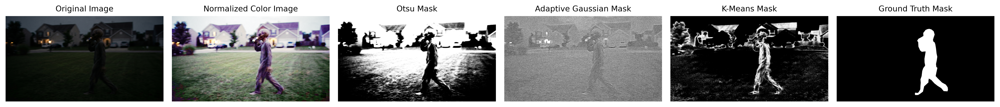

# Homework 2

This assigments goals were to compare different image segmentation techniques on the same input image and to evaluate the methods success at isolating the unknown image. The methods tested in this assignment were Adaptive Gaussian Thresholding, Otsu Thresholding, and K-Means Clustering (in HSV color space).

The final outputs are in a generated_images folder with the important outputs displayed at the bottom of the README.

```text
homework_two/
    ├── homework_two.py
    ├── myImage.png
    ├── README.md
    └── generated_images/
        ├── normalized/
        ├── otsu/
        ├── adaptive_gaussian/
        ├── kmeans_hsv/
        ├── masks/
        ├── plots/
        └── ground_truth/
```

## Setup and Execution

To run the program make sure myImage.png is located in the same folder as homework_two.py. Then run:

    python homework_two.py

If the ground truth mask has not already been created the polygon ground truth tool can be used to manually draw the object boundary. To activate the tool uncomment out this code with the main():

    # UNCOMMENT out the line of code below this if you need to make the ground truth
    # ground_truth_mask, ground_truth_segmented = methods.create_polygon_ground_truth(img, setup)

## Qualitative Analysis

### Adaptive Gaussian Thresholding

1. Pro: Adaptive does better than otsu at handling images with uneven lighting. Typically this is used for outdoor images since the lighting is uneven with different background textures

2. Con: Secondary to a cluttered small background detail or a poor block size the adaptive threshold can become noisy and include too much background noise.

3. Background Noise: Since the algorithm focuses on local pixel areas the background with highly detailed textures may get pulled to the foreground. This occurs since the method might treat these texture changes as important.

4. Color Normalization: This improves the contrast locally which can help the algorithm detect the unknown figure more clearly. Normalized images can also provide a sharper result. With what I discussed earlier that sharpness can increase false positive detections.

### Otsu Thresholding

1. Pro: Otsu does not require manually setting the threshold. This technique performs best when the foreground and background have a lighting contrast. So if the object is dark and the background is light or visa versa, then Otsu typically performs well.

2. Con: Otsu does not perform well with uneven lighting or heavy amounts of shadows. Like stated earlier this typically is seen with outdoor scenes.

3. Background Noise: Since Otsu looks at the full image histogram a lot of background noise can make the binary mask noisy causing the unknown figure to merge with sections of the background.

4. Color Normalization: The increase in contrast can help Otsu make the unknown figure stand out more against the background. Since histogram equalization can enhance background texture/noise like I discussed earlier this can cause issues with the unknown figure merging with the background.

### K-Means Color Space Clustering

1. Pro: K-means does not require grayscale intensity. It uses color imformation which can be beneficial for complex outdoor scenes.

2. Cons: K-Means does not detect the cluster with the target figure. This requires the individual to inspect the clusters and choose the cluster that best captures the figure. K-Means can produce different results when using random initialization.

3. Background Noise: If the background noise is similar in color to the unknown figure than this can cause them to be grouped into the same cluster. K-Means does typically handle background noise better than Otsu since its grouping on color similarity rather than just brightness.

4. Color Normalization: Since K-Means uses color to cluster normalization can improve K-Means by making the colors more distinct.

## Quantative Analysis

The segmentation methods were evaluated using Intersection over Union, also called the Jaccard Index, and the Dice Coefficient.

IoU measures the overlap existing between predicted mask and the ground truth mask compared to their combined area.

The Dice Coefficient also measures overlap, but it gives more weight to the shared region between predicted and the ground truth masks. A higher Dice score means better segmentation performance.

## Quantitative Segmentation Evaluation

| Segmentation Method            | IoU / Jaccard Index | Dice Coefficient |
| ------------------------------ | ------------------: | ---------------: |
| Otsu Thresholding              |              0.0263 |           0.0513 |
| Adaptive Gaussian Thresholding |              0.0564 |           0.1067 |
| K-Means HSV Clustering         |              0.1818 |           0.3077 |

## Ground Truth Analysis

The ground truth mask was manually created using a polygon selection around the unknown figure. The mask created was used as a reference for comparing the three segmentation methods.

Based on the quantitative results the ordering from best to worst was K-Means(HSV) > Adaptive Gaussian Thresholding > Otsu Thresholding.

### K-Means

K-Means had a IoU score showing about 18% overlap and a Dice coefficient of 0.3077. This showed the most promising results out of the three but it was still a poor detection method. While some the true object was detected, there was a large portion of the background included in the predicted mask.

### Adaptive Gaussian

Adaptive Gaussian thresholding had the second best or worst result out the three. This method's IoU score showed about 6% overlap and a Dice coefficient of 0.1067. In the Adaptive Gaussian threshold it did partially detect the figure but so much of the background was detected that it resulted in a poor IoU/Dice scores.

### Otsu

Otsu threshold was the least effective. This method's IoU score showed about 3% overlap and a Dice coefficient of 0.0513. Like K-Means and Adaptive, Otsu did partially detect the figure but it also heavily detected the background resulting in a poor IoU/Dice score.


